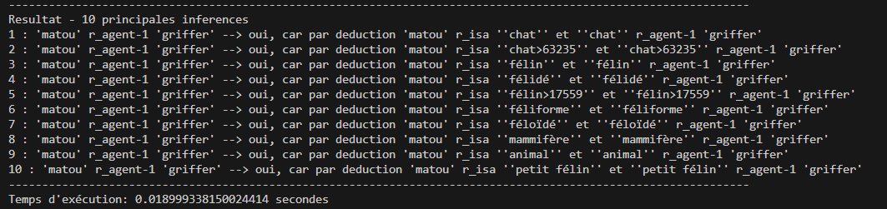
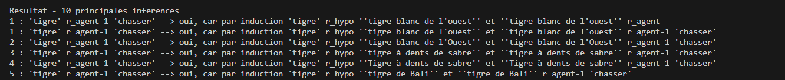
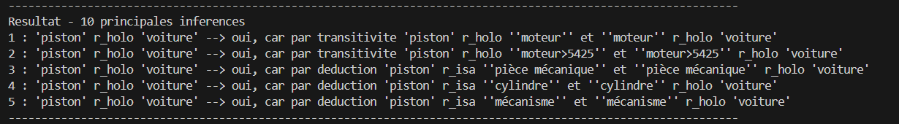

# Travail fait par

* Charles Langlois
* Chaymae Chouari

# HAI815 - Language Naturel

Dans le cadre du cours HAI815 Langage Naturel, nous avons réalisé un programme console qui trouve les inférences (inductions, déductions et transitivités) à partir de fichiers récupérés sur JeuxDeMots.

https://www.jeuxdemots.org/jdm-accueil.php

# Package python requis
```python
import sys
import re
import requests
import time
import os
import numpy as np
```
# Pour tester
Notre programme prend en parametre le nom du noeud A, le nom de la relation et le nom du noeud B. 

## Deduction
Pour tester si la relation matou r_agent-1 griffer existe, voici comment executer le code.
```bash
python __main__.py matou r_agent-1 griffer
```
## Induction
```bash
python __main__.py tigre r_agent-1 chasser
```
## Transitivite
```bash
python __main__.py piston r_holo voiture  
```

# Exemple
Voici des exemples de reponses sur la console.





